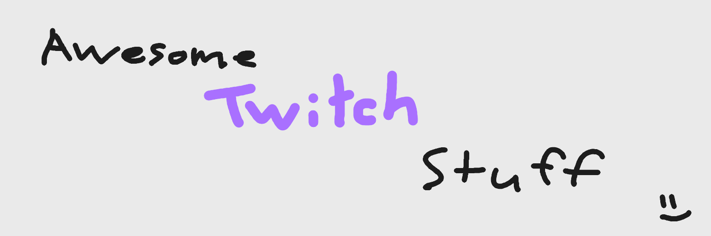

# Awesome Twitch Stuff
A list of awesome Twitch/streaming-related tools.

## Tags
🌎 - Open source 
💸 - Paid 
🆓 - Free to use

## Ungrouped list (will sort)

 - [7TV](https://7tv.app) - A new 3rd party emote service and extension for Twitch and YouTube. [🌎🆓]
 - [BadgeBase](https://badgebase.co/) - Chat Badges and Emotes tracker. [🆓]
 - [BetterTTV](https://betterttv.com) - 3rd party emote service with support for animated emotes. [🆓]
 - [Chat Vault](https://chatvau.lt/) - Discover emotes, badges, and channels from Twitch, YouTube, Kick, and popular third-party extensions in one organized place. [🆓]
 - [Chatsen](https://github.com/chatsen/chatsen/#chatsen) - Chatsen is a cross-platform application (iOS & Android) that allows you to chat on Twitch with support for 3rd-party services such as 7TV, BTTV and FFZ. [🌎🆓]
 - [Chatterino 7TV](https://github.com/SevenTV/chatterino7) - Chatterino with extra 7TV features. [🌎]
 - [Chatterino](https://chatterino.com) - A mutli-platform Twitch chat client. [🌎]
 - [Chatty](https://chatty.github.io) - A chat software specifically made for Twitch, running on any OS supporting Java 8 or later. [🌎]
 - [Collaborative Overlay](https://luscious.dev/overlay/) - Collaborative Overlays are a tool for live streamers to give some control over their stream to trusted individuals. [🆓]
 - [Cord.DJ](https://cord.dj/) - Listen to music with friends together. [🆓]
 - [DankChat](https://github.com/flex3r/DankChat/#-dankchat) - A chat client for Android. [🌎🆓]
 - [DecAPI](https://decapi.me/) - API provider/proxy that provides plaintext responses. [🌎🆓]
 - [Emote Tester](https://emotetester.gempir.com/) - Test your emotes in fake chat rooms before uploading. [🌎🆓]
 - [EmoteDisplay](https://github.com/instafluff/EmoteDisplay#emotedisplay) - Display the latest Twitch Chat Emote on stream! [🌎🆓]
 - [Fossabot](https://fossabot.com) - A Twitch chat bot that has all the features you need to create the ultimate chat experience for yourself and your audience. [🆓]
 - [FrankerFaceZ](https://frankerfacez.com) - 3rd party emote service featuring wide emotes. [🆓]
 - [Frosty](https://www.frostyapp.io/) - Frosty lets you watch Twitch with 7TV, BTTV, and FFZ emotes (on iOS & Android). [🌎🆓]
 - [Groke.se](https://groke.se/twitch/spotify) - Allows retrieval of the currently playing Spotify song by most chat bots via account linking. [🆓]
 - [Kruiz Control](https://github.com/Kruiser8/Kruiz-Control#kruiz-control) - Kruiz Control enables a pseudo code approach to manage and automatically handle Twitch chat and events, OBS or SLOBS, and StreamElements or Streamlabs alerts. [🌎]
 - [Kudo Pepega](https://teclu.github.io/Kudo-Pepega/) - A Group Card Alternative. Free of charge; no pesky catches. [🌎🆓]
 - [Levi506's Emote Tester](https://levi506.net/emote-tester) - Test emotes for scaling/contrast issues before they're uploaded. [🆓]
 - [MakeEmoji](https://makeemoji.com/) - The #1 Free Online Emoji Maker for Custom Animated Emojis. [🆓]
 - [NightBot](https://nightbot.tv) - A chat bot for Twitch, YouTube, and Trovo that allows you to automate your live stream's chat with moderation and new features, allowing you to spend more time entertaining your viewers. [🆓]
 - [NowPlaying](https://widget.nowplaying.site/) - Show your currently playing song by connecting your StreamElements & Spotify accounts. [🆓]
 - [OBS Stats on Stream](https://obsproject.com/forum/resources/obs-stats-on-stream.1319/) - An OBS script to show OBS stats on stream as Text Source and/or print in chat.. [🌎🆓]
 - [OBS/Twitch Animal GIF Overlay](https://github.com/stphnnnn/obs-twitch-chat-animal-gif-overlay) - Displays a cat or dog GIF in an OBS browser source when a user types the command `!dogpls` or `!catpls`. [🌎🆓]
 - [OBS](https://obsproject.com/) - Free and open source software for video recording and live streaming. [🌎🆓]
 - [Pogly](https://pogly.gg/) - Real-time collaborative stream overlay powered by SpacetimeDB. [🌎]
 - [Pubby](https://pubby.club) - Plug.dj-inspired room-based DJ service supporting Soundcloud, YouTube, and Vimeo media. [🆓]
 - [QueUp](https://queup.net) - Social DJ site where users can share and discover the music by tuning in to user-generated playlists (formerly Dubtrack). [🆓]
 - [Rewards](https://rewards.nerixyz.de/) - An application that manages custom Twitch rewards. [🌎🆓]
 - [StreamElements](https://streamelements.com) - The ultimate streamer platform. [🆓/💸]
 - [StreamLabs](https://streamlabs.com/) - All-in-one suite for live streamers. [🆓/💸]
 - [Supibot](https://supinic.com) - Multiplatform, utility & novelty chat bot. [🆓]
 - [Tenami](https://tenami.tv/) - Rent your favorite TV shows and movies for livestreams on YouTube and Twitch. [💸]
 - [That Horse Game](https://luscious.dev/overlay/horse) - A horse game overlay [🆓]
 - [ThePositiveBot](https://roaringiron.com/thepositivebot/) - A Twitch.tv Chatbot, packed with hours of fun and entertaining features to improve the offline chatting experience. [🆓]
 - [Titlechange\_bot](https://www.twitch.tv/titlechange_bot/about) - Chatbot mentioning people whenever streamer goes live/offline or changes title/game. [🌎🆓]
 - [Twichat](https://twitchat.fr/) - Alternative Twitch chat for streamers with lots of extra features for enhanced streaming comfort [🌎🆓]
 - [Twitch Emote Resizer](https://tma02.github.io/twitch-emote-resizer/) - Quick and easy way to resize images to Twitch emote and badge sizes online with your browser. [🌎🆓]
 - [Twitch Emote Spray](https://github.com/andrej-ilic/twitch-emote-spray) - Twitch Emote Spray is a twitch overlay that displays emotes posted in chat. [🌎🆓]
 - [Twitch Interactive Chat Overlay](https://github.com/talk2MeGooseman/twitch-interactive-overlay) - Twitch Interactive Chat Overlay is a simple and fun overlay to add to your stream that gives chat a new way to interact with you and fellow members of chat. [🌎🆓]
 - [Twitch Tools by \@CommanderRoot](https://twitch-tools.rootonline.de/) - A collection of tools for Twitch. [🆓]
 - [TwitchListOverlay](https://github.com/matthewjohnston4/TwitchListOverlay) - A simple OBS overlay to allow a Twitch channel's broadcaster or mods to add a titled list of items to their stream, via Twitch chat commands or an OBS broadcast dock. [🌎]
 - [chat.vote](https://chat.vote) - A site that lets you make polls that you vote on by typing in chat. Also has raffles and strawpoll-style shareable polls. [🆓]
 - [emoteJAM](https://tsoding.github.io/emoteJAM/) - A simple website that generates animated emotes from static images. [🌎🆓]
 - [gempbot](https://bot.gempir.com/) - A Twitch chat bot that allows users to add 7TV emotes through channel points, and announce predictions in chat. [🌎🆓]
 - [jChat](https://www.giambaj.it/twitch/jchat/) - Customizable chat overlay supporting 7TV, BetterTTV, & FFZ emotes. [🌎🆓]
 - [peepoStream](https://peepostream.com/) - Your one-stop shop for everything viewer engagement. [🌎🆓]
 - [petpet generator](https://benisland.neocities.org/petpet/) - Generate a petting emote using your uploaded image. [🆓]
 - [vdo.ninja](https://vdo.ninja) - Bring live video from your smartphone, remote computer, or friends directly into OBS or other studio software. [🆓]
